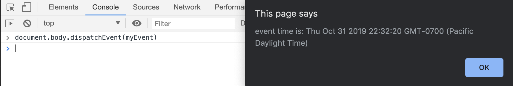

# javascript_react_for_devs
https://www.udemy.com/course/js-and-react-for-devs

### 2. DOM
#### what is the DOM
- use `DOM/index.html`
- glorified javascript object that we c an use to manipulate our page
- `command + option + j` for dev tools
- typing `document` in the console gives a html-like representatuon of the nodes on the page
- try `console.dir(document)`
- click `body`
- click `childNodes`

#### what can i do with the DOM
- use `DOM/index.html`
- add and `id` to `h1` and a `class` to `ul`
- 
`<h1 id="header"></h1>`
and
`<ul class="list"></ul>`

- Getting an element
* getElementById()
```
document.getElementById("header")
<h1 id="header">The DOM is cool for many reasons.<h1>
```

* getElementsByClassName()
```
document.getElementsByClassName("list")
HTMLCollection [ul.list]
0: ul.listlength: 1
__proto__: ...
```
- since there is only one item in the list, we can use, 
```
document.getElementsByClassName("list")[0]
<ul class=​"list">​
<li>​You can see how pages are made​</li>​
<li>​You can manipulate it​</li>​
</ul>​
```

* getElementsByTagName()
```
document.getElementsByTagName('li')
HTMLCollection(2) [li, li]
0: li
1: lilength: 2
__proto__: HTMLCollection
```

* `document.querySelector()`; css selectors
- ids like the header id 
```
document.querySelector('#header')
<h1 id=​"header">​The DOM is cool for many reasons.​</h1>​
```

- classes like the list class
```
document.querySelector('.list')
<ul class=​"list">​
<li>​You can see how pages are made​</li>​
<li>​You can manipulate it​</li>​
</ul>​
```

* `document.querySelectorAll()` will give an array for lists
```
document.querySelectorAll('.list')
NodeList [ul.list]
0: ul.listl
ength: 1
__proto__: NodeList
```

* `document.querySelector('.list').children`
- get the list which is the `ul` then get the children `li`
```
document.querySelector('.list').children
HTMLCollection(2) [li, li]
0: li
1: li
length: 2
__proto__: HTMLCollection
```

* `document.querySelector('.list').children[0]`
```
document.querySelector('.list').children[0]
<li>​You can see how pages are made​</li>​
```
- we can manipulate this directly in the DOM by changing the text `<li>​Hola</li>​`

- Creating things in the document
* createElement()
```
var p = document.createElement('p')
p.innerText = 'our new element'
"our new element"
p
<p>​our new element​</p>​
document.body.appendChild(p)
<p>​our new element​</p>​
```
* createAttribute()
```
var att = document.createAttribute('id')
undefined
att.value = 'created'
"created"
p.setAttributeNode(att)
null
```
- then go to the elements tab and we should see
```
<p id="created">our new element</p>
```
- The DOM activity: Find a DOM Node
- how would you implement `getElementsByAttribute('data-js-name', 'foo')`
- Suggested steps
- get all the lements in the DOM
- check if they have the particular attribute
- check that the attribute has the correct value

- Solution use a script `activity.js` and add it to `index_one.html`
```
function getElementByAttribute(attribute, value) {
    var all = document.getElementsByTagName('*');
    var found = [];

    for (var i =0; i <all.length; i++) {
        element = all[i];
        if (all[i].getAtrribute(attribute) === value) {
            found.push(all[i]);
        }
    }
    return found;
}
```
- Explanation
function get elements by attribute and it takes in the designated attribute

and the value.

So the first thing I do is I get all of the elements in the DOM here.

So I do get elements by tag name and then if you do a star that's a regular expression it just pulls

in all of the elements.

And then I initialize an empty array here called found because that's going to be our empty array of

found elements that will ultimately return.

Then I loop through all of the elements and for each element in there I check if get attribute has this

particular attribute here.

And if it has that attribute it equals the value and if that's true it pushes it into the found array.

Otherwise if it doesn't equal that then it just keeps going throughout the loop.

Now to test this out I took my original index ID Tamal and I added a couple unique attributes here.

And then I just kept the class header.

- Test using:
`getElementsByAttribute("category", "feature")`
and
`getElementsByAttribute("class", "header")`

### 3. Events and Callbacks
#### Events
- occurences in the browser that fire signals
- `click` which happens when a user clicks 
- `resize` which occurs when the user resizes the document 
- `keydown` , `keypress`,  and `keyup` which occurs when the user interacts with the keyboard
- `mouseover` which occurs when a mouse is moved over an element
- `load` which occurs when the resource has finished loading

#### Callbacks
```
window.addEventListener('load', function(event) {
    console.log('All resources finished loading!);
});
```
- adds event listener to the window object
- the listener waits for the load event and then once that event has been triggered it calls the function in the second parameter and that function passes in an event object; the function in the second parameter is a callback

- callback: Put simply is a function that's passed into another function and called after something occurs with
regards to events. The callback is an event handler.

- EXAMPLE
Let's say you have an html page with some buttons on it.

Then when you go to the actual page they don't do anything.

Let's add some event listeners 
* Button one
- for button one we are waiting for a click `addEventListener('click')`
- the second parameter will be our callback function; anonymous in this case
```
function() {
  console.log('you clicked the button!'
```

* Button two
 - for button two we are waiting for mouseover `addEventListener('mouseover'`
 - the anonymous callback function changes the text of the button whenever the user mouses over it to `you hovered and over me`   

* Custome events
- example our custome event is `timeEvent'` added to the event listener`addEventListener('timeEvent'`
- our callback function is stateTime
- pass in event `e` and we'll alert some data about `e`
- create a custom event object using the special javascript object for custom events; `CustomEvent`; and we're going to call this event `timeEvent`
- add data using property `detail` whose value is a new Date() objects

Explanation
while we wait for this `timeEvent` event we call the function `stateTime` which takes in an event object, `myEvent` which is a `CustomEvent`;
Custom event is an object and has a named `timeEvent` just
like the one we're listening for; it has the property `detail` which gives us the customer time;
finally, the body has to dispatch the event
`document.body.addEventListener('timeEvent')`
- Test it on the browswer


* Events and Callbacks Activity: Website and Theme Toggler
####
####


